```{css echo=FALSE}
.pull-left {
  float: left;
  width: 44%;
}
.pull-right {
  float: right;
  width: 44%;
}
.pull-right ~ p {
  clear: both;
}
```

# Introduction
.pull-left[
- Was infrastructure important in early economic development?
- Ongoing debate since Fogel (1964) 
- Nature provides infrastructure on sometimes it changes 
- In 1825 the Agger isthmus* broke by 1834 a natural canal had formed 


#### The argument:
- Strong effect only when secondary infrastructure emerges (ports, roads, etc)
- Explains mystery of inflated effects of Market Access (Redding & Turner, 2015)


]

.pull-right[
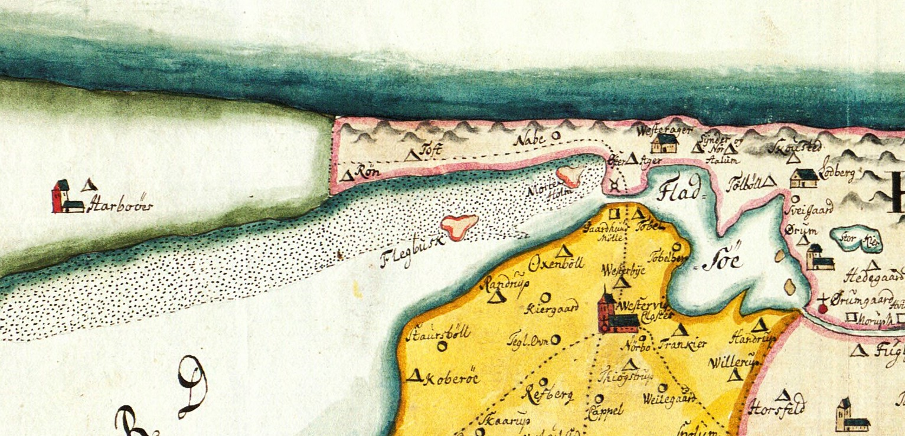
*Moldrup (1750), kb.dk*

**Isthmus* (Wikipedia)
]


???
**3/45**  
- Understanding what causes wealth (wellbeing, etc.) is at the heart of Economics 
- Understanding the interplay between geography (environment) and Economics is vital in the 21st century

---
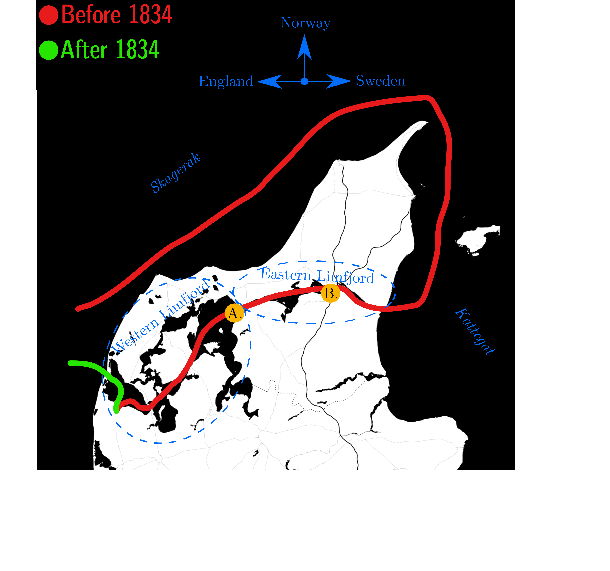

---
# Map
.center[
<iframe src="https://www.google.com/maps/embed?pb=!1m14!1m12!1m3!1d704129.7470425251!2d8.826970647896832!3d56.880787313536544!2m3!1f0!2f0!3f0!3m2!1i1024!2i768!4f13.1!5e1!3m2!1sda!2sdk!4v1634159326111!5m2!1sda!2sdk" width="600" height="450" style="border:0;" allowfullscreen="" loading="lazy"></iframe>
]

---
### Safer, more convenient harbours

*Dangerous loading on the west coast*

---
# Contribution 
.pull-left[
- Does infrastructure promote regional development? (Fogel, 1964; Donalson & Hornbeck, 2016; etc.)
- Does trade cause growth? (Frankel & Romer, 1999; Feyrer, 2021)
- Fundamental determinants of economic wealth: *Institutions or geography?* 
- Pragmatically: Infrastructure is expensive

**Why this case?**: 
- Best case experiment 
- Uniquely well-identified exogenous variation in trade-enabling infrastructure. 
]


.pull-right[
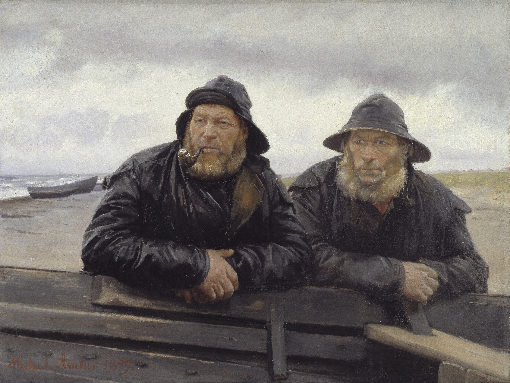
*'Two fishermen by a boat', Anker (1889), smk.dk*  
]

???
**15/45**

---
# Timeline

--

#### Pre-event: 
- 1672: Eastern Limfjord town Aalborg 2nd largest in DK 
- Other Limfjord towns lacked far behind under Aalborg's local hedgemony

--

#### Event:
- 1825: Breach of Agger Isthmus
- 1834: Ships start consistently passing through a new natural canal 
- 1841: Independent trade rights to west Limfjord market towns 
- 1840-1860: Secondary infrastructure and growth 
- 1860-1900: Strong(er) growth

---
# Empirical strategy
#### What will be demonstrated
  - The canal caused trade 
  - Trade caused growth in population 

--

#### Approach

$$y_{it} = exp(Treatment_i \times Year_t \beta_t + FE + \varepsilon_{it})$$

Estimated by OLS on $log(y_{it})$ or Poission 

*Treament is:*
- The **West** Limfjord, or
- Improved **market access** after the breach

--

#### If time:   
  - Brickworks 
  - Mechanism 
  - Viking age reverse natural experiment


---
name: str-presentation
# 1. Trade: Sound Toll Register (STR)

.pull-left[
- Most ships to and from the Baltic region (1.8 mio. passages, 1497-1857) 
- Extract traffic for Denmark  
- Digitized by team at Gronningen (Veluwenkamp & Woude, 2009)
- Only ships passing [Elsinore](#elsinor)
 

*Kronborg at Elsinore anno 1500, wikimedia commons*
]

.pull-right[

*Page from Sound Toll Register, (soundtoll.nl)*
]

---
# 2. Population: Census data

.pull-left[
- Danish Demographic Database 
- Individual-level data for the years 1787, 1801, 1834, 1845, 1860, 1870, 1890 and 1901 
- From this: Parish level population counts (and more in the future)
]

.pull-right[
*Census, wikimedia commons*


]


---
# Geographical division 

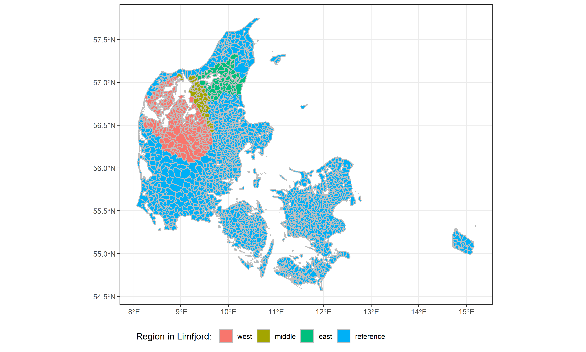
*Map made from based on data from DIGDAG.*


---
# The canal caused trade (1/2)

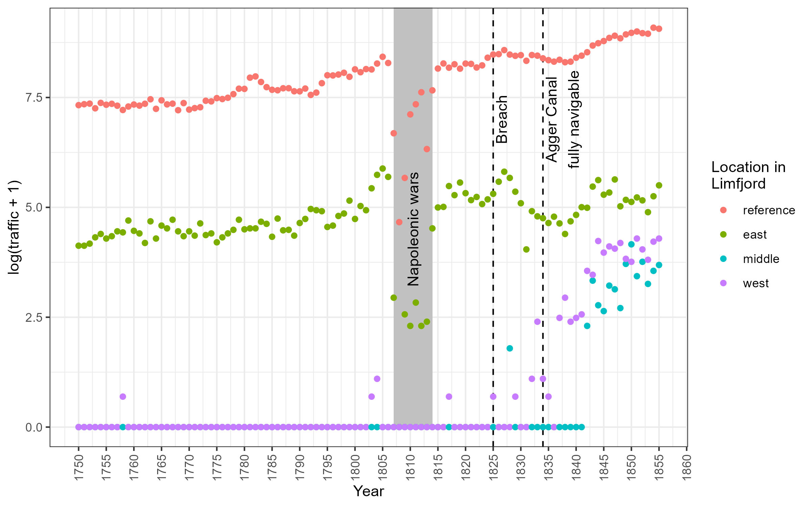
---
name: str-results
# The canal caused trade (2/2)
.pull-left[
- **Data**: Panel of Danish ports 1750-1855 
- **Outcome**: Cargo ship traffic with origin or destination in a specified port
- DiD estimate 
- PPML estimator following Silva & Tenreyro (2006) 
- In the order of 400% growth in trade in the region
- Problem with [Elsinor](#elsinor) motivates different measure
]
.pull-right[
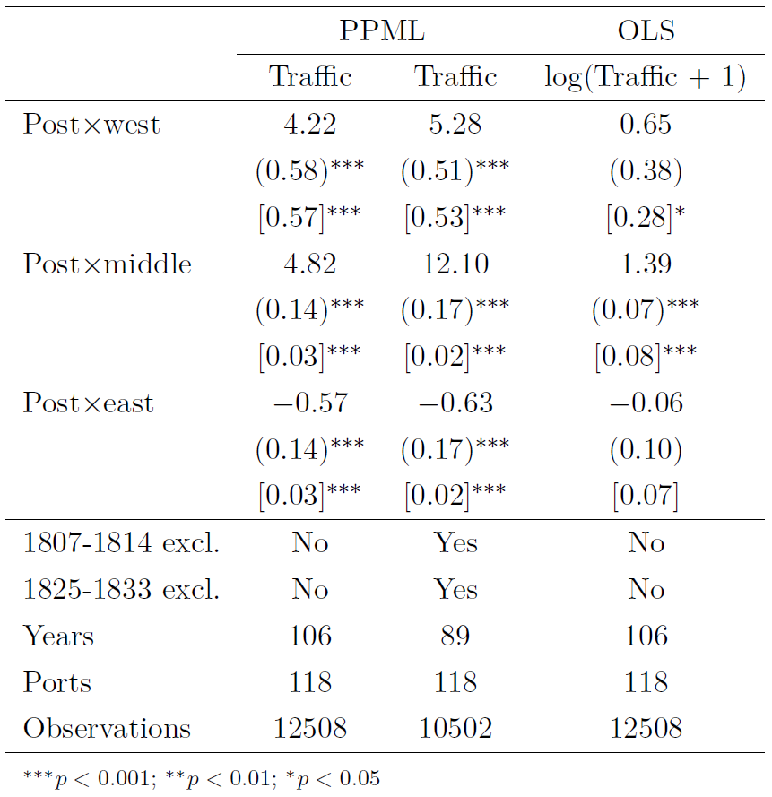
- *[Robustness: Only Origin/Destination](#onlyfromto)*<br>
- *[Port-level results](#str-results2)*
]

---
# Market Access
.pull-left[
Based on cost distance from parishes to harbours: 
$${MA}_p = \sum_{h \in H} [CostDist(p, h) + 1]^\theta \times W_{p}$$
- CostDist - Dijkstra's agorithm and 1/10 land/sea ratio 
- $\theta = -1$  
- Breach caused new harbours in West Limfjord: $H\rightarrow H^*$

$$MA_{before} = MA_p|H \\
MA_{after} = MA_p|H^*$$
Main measure:
$$\Delta log(MA) = log(MA_{after})-log(MA_{before})$$
]

.pull-right[
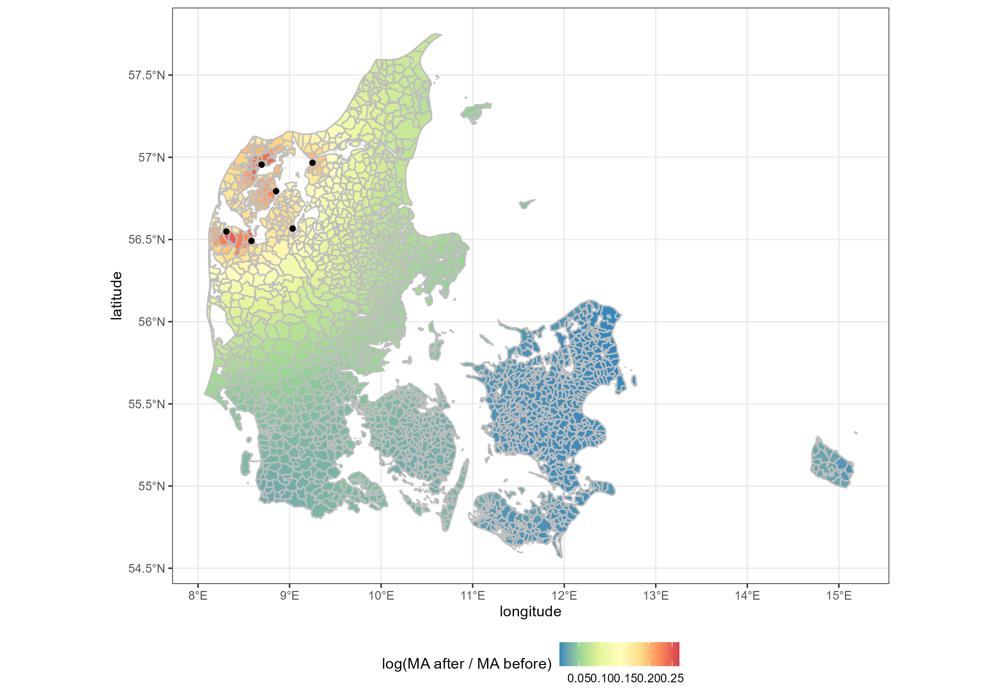
*Larger on the next page*
]

---
# log Change in Market Access


---
name: pop-ma
# Trade caused growth in population (1/2)
#### Market Access approach
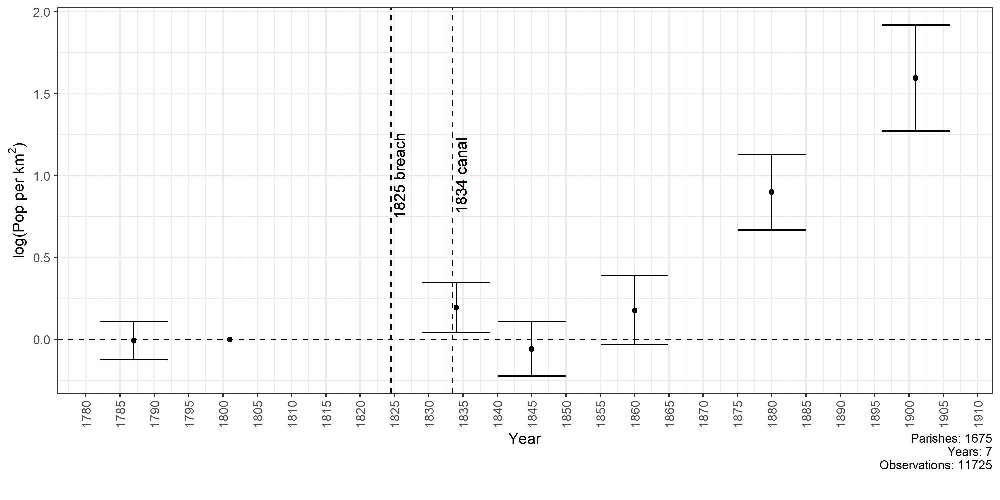
- The elasticity of population to market access: 1.62%  
([All feasible MA params.](#all-paramMA), [Outliers](#popma-outliers), [Poisson](#ma-pois))

???
- Rauch & Maurer (2022): 2.3 for panama canal 

---
name: pop-dummy
# Trade caused growth in population (2/2)
#### Dummy approach
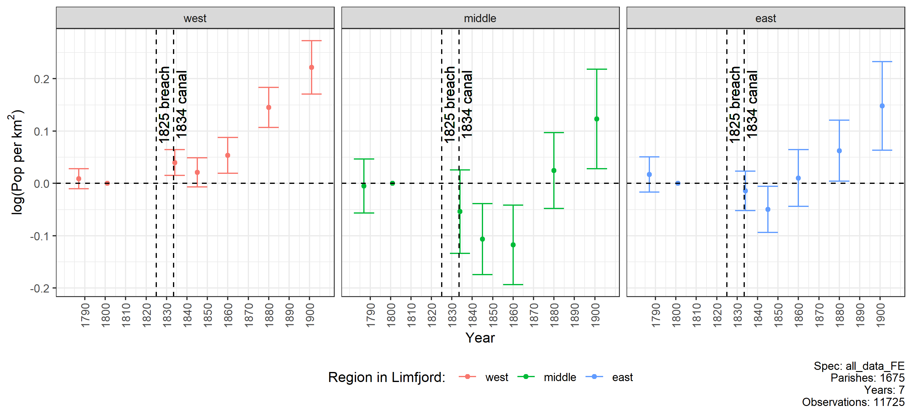
- 23% population growth by 1901 in the West Limfjord region  
([Many alternative specs](#specs-dummy), [Urban/rural het.](#heterogendummy), [Poisson](#dummy-pois))

???

---
name: other-results
# Conclusion
- Infrastructure causes growth, but only strongly so because of the secondary infrastructure

.footnote[
**Email**: christian-vs@sam.sdu.dk;<br>
**Twitter**: @Christian Vedel<br>
Feel free to reach out :-)
]

<br>

.pull-left[
### Moving forward
- Exploring mechanism: HISCO-coded census-data 
- Quantifying secondary infrastructure 
- Growth or reallocation?  
]

.pull-right[
### Other results
- [Proto-industrialisation via Brickworks, p. 31](#brickworks)
- [Mechanism, p. 33](#mechanism) 
- [External Validity and Vikings, p. 37](#external)

]

---
count: false
class: center, middle
# Appendix

---
name: new-ports
# New ports
[Back](#post-event)


---
name: railways1
# Railways (1/2)
[Back](#post-event)

.pull-left[

]

.pull-right[


]

Source: Fertner (2013)

---
name: railways2
# Railways (2/2)
[Back](#post-event)
.pull-left[
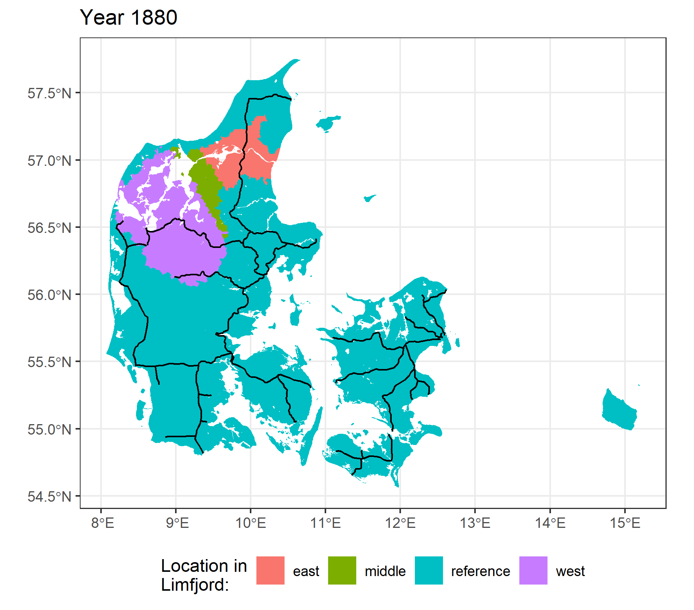
]

.pull-right[

]

Source: Fertner (2013)

---
name: elsinor
# Elsinor


.center[
<iframe src="https://www.google.com/maps/embed?pb=!1m14!1m12!1m3!1d3743.038856836935!2d12.616720634729397!3d56.03904113734528!2m3!1f0!2f0!3f0!3m2!1i1024!2i768!4f13.1!5e1!3m2!1sda!2sdk!4v1655049802848!5m2!1sda!2sdk" width="600" height="450" style="border:0;" allowfullscreen="" loading="lazy" referrerpolicy="no-referrer-when-downgrade"></iframe>
]

[Back to STR](#str-presentation), [Back to results](#str-results)

---
name: str-results2
# The canal caused trade
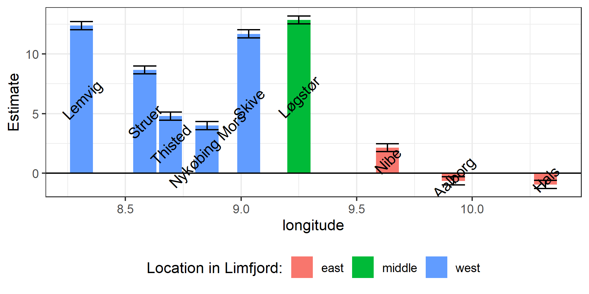

[APEs](#apes)

.footnote[
[Back](#str-results)
]

---
name: onlyfromto
# Traffic origin/destination
.pull-left[
### Only destination

]

.pull-right[
### Only origin
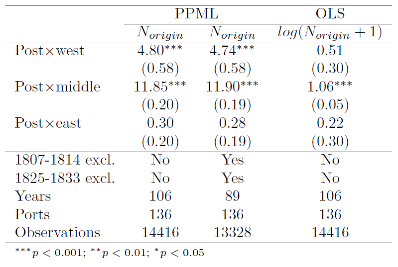
]

.footnote[
[Back](#str-results)
]


---
name: all-paramMA
### All feasible MA parameters
[Back](#pop-ma)

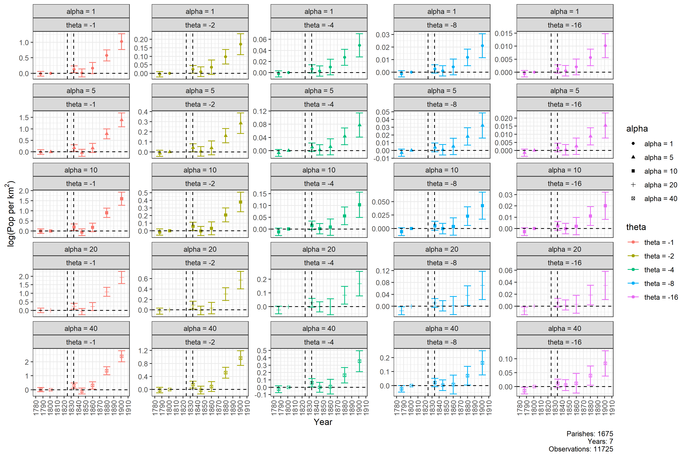


---
name: popma-outliers
### Robustness to outliers
[Back](#pop-ma)
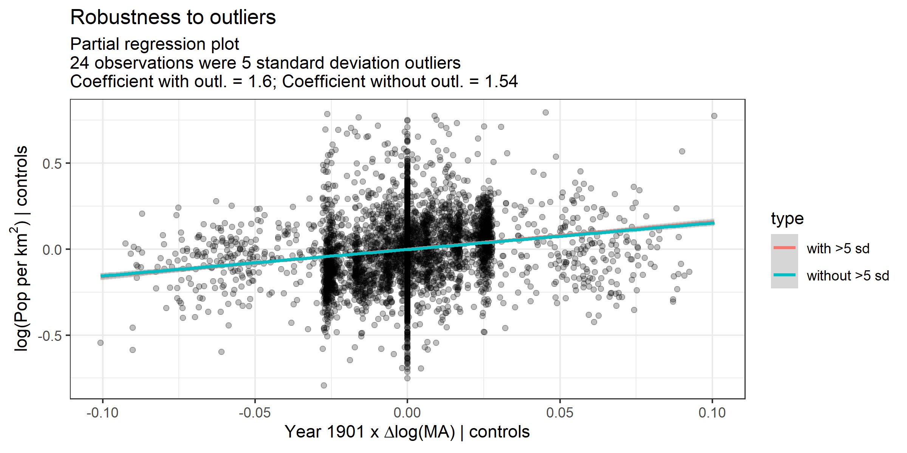

---
name: specs-dummy
# All feasible specifications


.footnote[
[Back](#pop-dummy)
]

---
name: heterogendummy
# Urban/Rural heterogenous effects

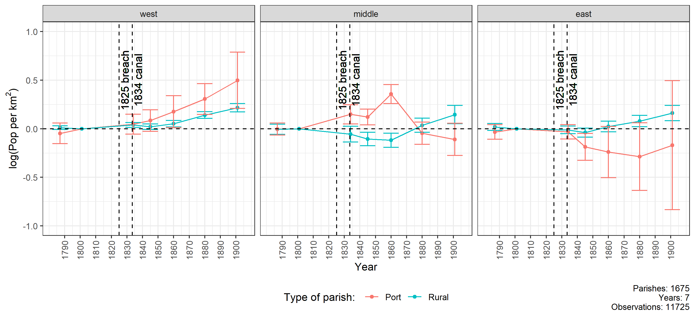

.footnote[
[Back](#pop-dummy)
]

---
name: fish
# Environmental impact
[Back](#mechanism1)


---
name: newspapers
# Newspapers
[Back](#MAadditional)

.pull-left[
- Based on all newspapers in published in the period
]

.pull-right[

]

---
name: apes
# APEs

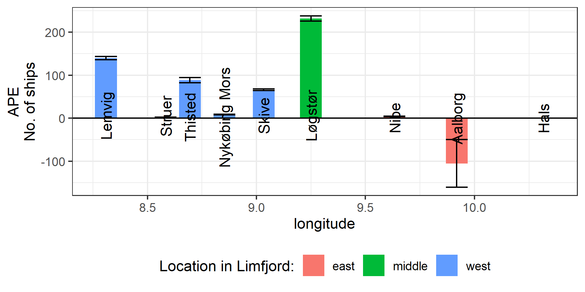


$$APE_h = exp(X\beta)\beta_h$$
.footnote[
[Back](#str-results2)
]

---
name: brickworks
count: false
class: center, middle

# Brickworks


.footnote[
[Back](#other-results)
]


---
# Brickworks data

.pull-left[
- Retired mason (Verner Bjerge) has digitized the location of all brickworks 
- Panel constructed: Number of brickworks in each parish each year 

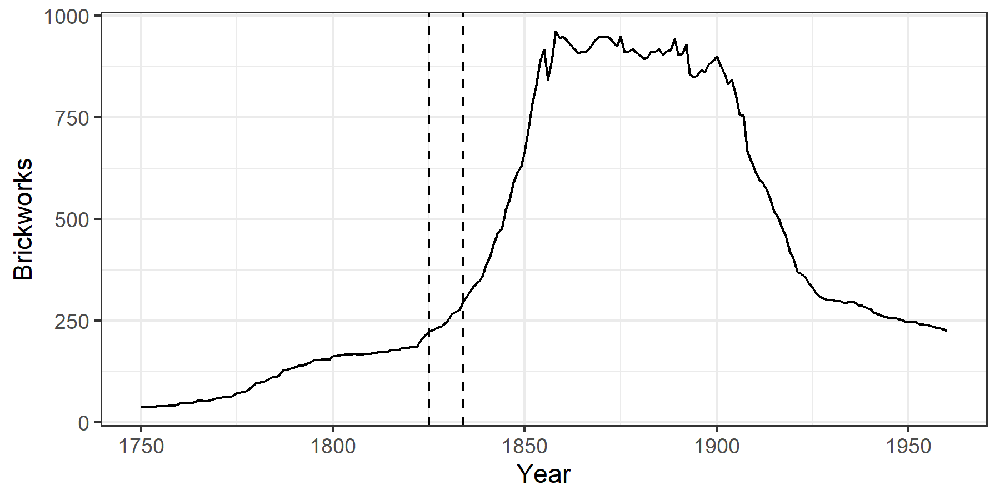

]

.pull-right[

Verner Bjerge with his collection of bricks
]

.footnote[
[Back](#other-results)
]

---
# Trade caused growth in brickworks
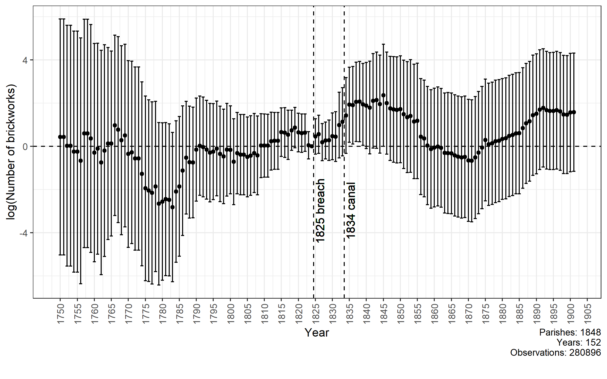

.footnote[
[Back](#other-results)
]

---
name: mechanism
count: false
class: center, middle

# Mechanism


.footnote[
[Back](#other-results)
]

---
name: mechanism1
# Mechanism
.pull-left[
- **First-order mechanism:** Trade (as documented)
- **Remaining question**: Why was take-off relatively slow? 
  + Initial evnrionmental impact [(Poulsen et al, 2007)](#fish) 
  + Boost from secondary infrastructure
]

.pull-right[
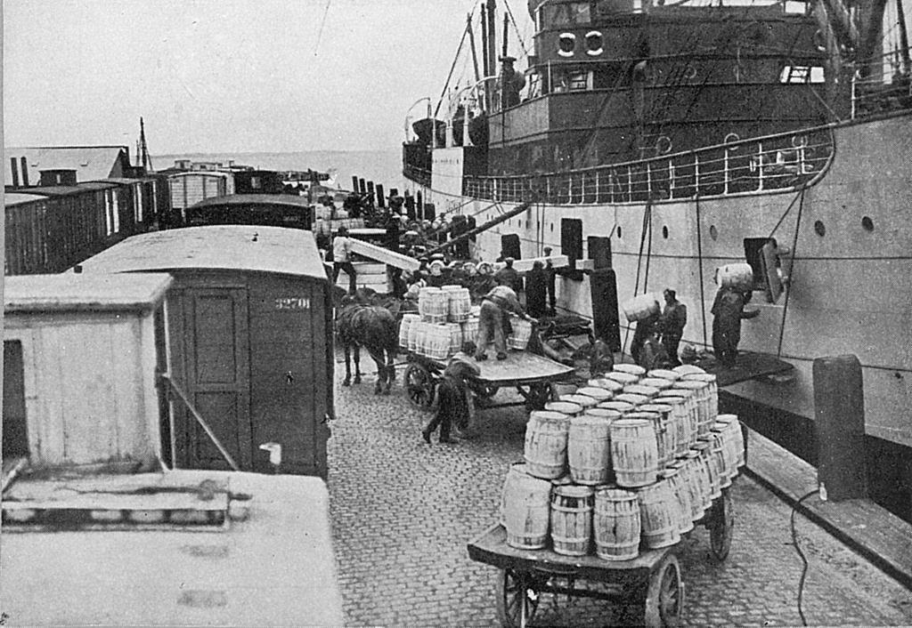
*Loading Butter in a Danish port (1924)*
]

.footnote[
[Back](#other-results)
]

---
name: post-event
# Mechanism: Secondary infrastructure

.pull-left[
#### Examples:
- 1840s: [New ports were constructed in all west Limfjord market towns](#new-ports)
- 1841: Independent rights for international trade
- 1852: First ever Danish steam route to England 
- 1856-1861: Construction of the Frederik VII channel at Løgstør 
- 1860-1900: [Railways](#railways1) and highways 
- 1875-1933: Groins to stabilise natural canal (and coast) 
]


.pull-right[
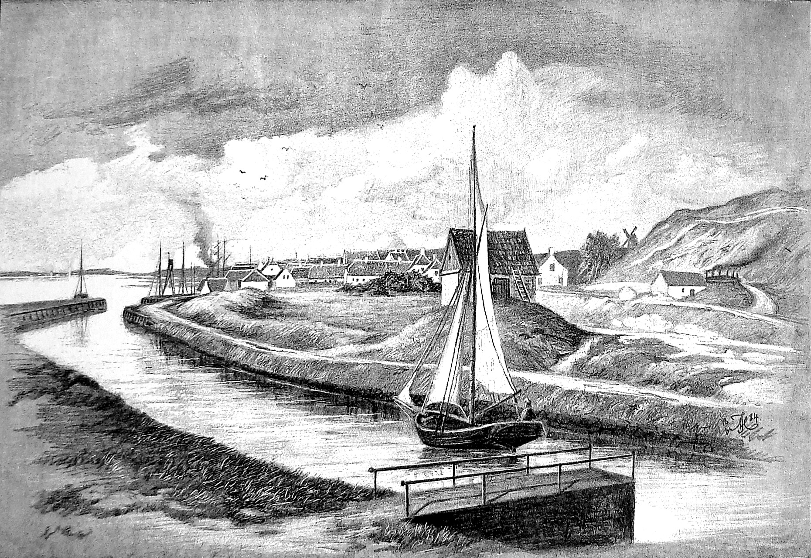
*Milton (1884) Frederik VII canal*


*'Placat' announcing trade rights of Limfjord market towns*
]

.footnote[
[Back](#other-results)
]

---
# Testing the mechanism

**Ideal case:** Market Access for all secondary infrastructure 
#### Preliminary alternative
- Empirical prediction: 
  + *If secondary infrastructure becomes important the market access of initial shock should become relatively less important*

Regression: 
$$log(Pop\:dens_{it})=West_{i}\times\Delta\log(MA)_i\times Year_t \beta_{tl} + FE + \varepsilon_{it}$$

- *Dose response curve: Effect of MA within West Limfjord region*
- This shows how important MA was for population growth 

.footnote[
[Back](#other-results)
]

---
name: MAadditional
# Effect of MA additional to west
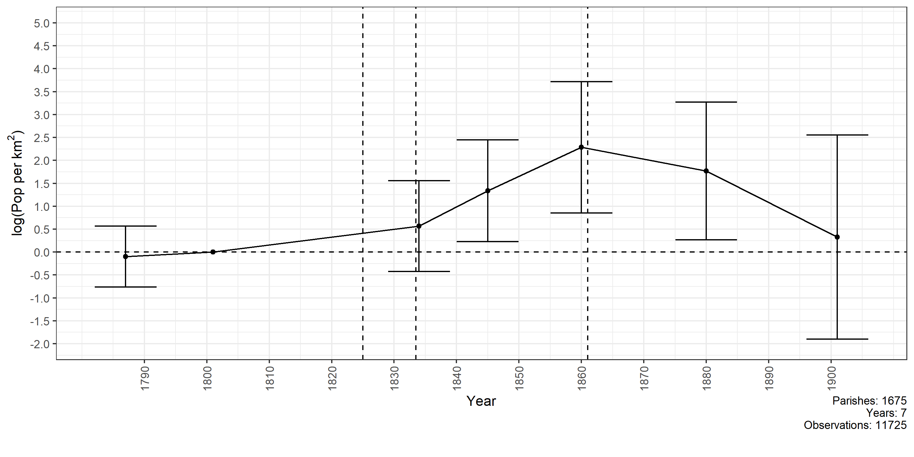
- Effect of MA peaks as secondary infrastructure becomes more important 

.footnote[
[Back](#other-results), [Alternative](#newspapers)
]


---
name: external
count: false
class: center, middle

# External validity and Vikings


.footnote[
[Back](#other-results)
]


---
# External validity and Vikings

.pull-left[ 
- The Limfjord also had a western opening in the Viking age. 
- Ideal hub for viking fleets heading west towards England (Matthiessen 1941; Rasmussen, 1966) 
- North Western Denmark in 1100s is very different from ditto in 1800s
- Between 1086 and 1150 the canal silted up 
- **Data:** Panel of archaeological sites containing coins
- 2162 dated sites between 500 and 1500
]

.pull-right[

*'Overseas Guests', Roerich (1901)*

*maps.stamen.com*
]

.footnote[
[Back](#other-results)
]

---
# Descriptive results


.footnote[
[Back](#other-results)
]

---
name: dummy-pois
# Population growth - Poisson
#### Dummy

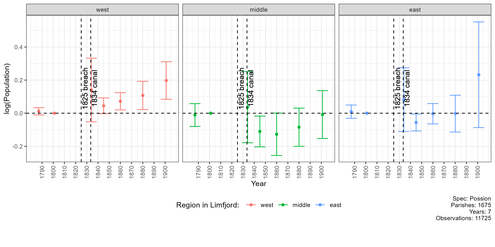

.footnote[
[Back](#pop-dummy)
]

---
name: ma-pois
# Population growth 
#### Dummy Poisson

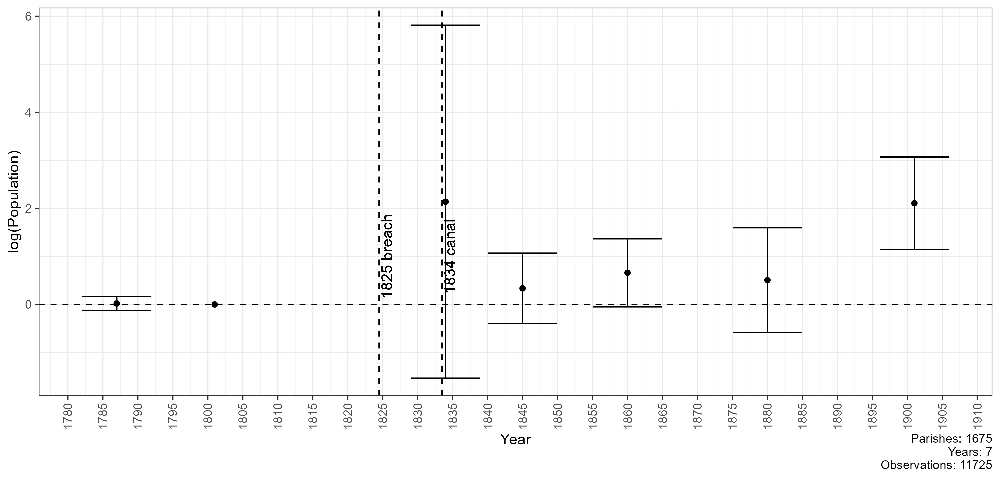

.footnote[
[Back](#pop-ma)
]
